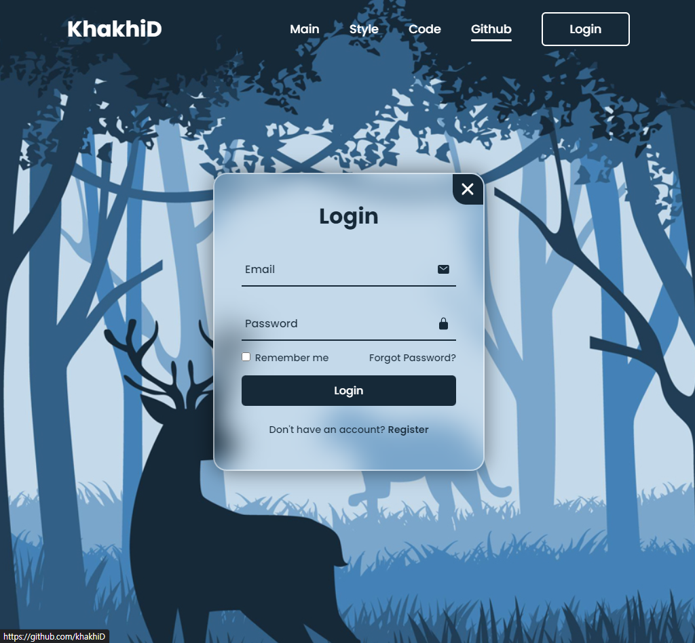

# Login-and-Register
> 깔끔한 스타일이 적용된 로그인 & 회원가입 화면 만들기   
> `참고: https://www.youtube.com/watch?v=p1GmFCGuVjw&list=WL&index=17`

* 기본 CSS와 HTML, 바닐라 자바스크립트 사용
* CSS 70%, HTML 20%, JS 10%

## TIL
* Wrapper 클래스 CSS 참고
  * overflow: hidden; -> 요소 바깥으로 튀어나오는 자식요소 숨기기
  * backdrop-filter: blur(20px);
  * box-shadow: 0 0 30px rgba(0, 0, 0, .5);
* 깔끔한 트랜지션
  * transform: scale(0) -> scale(1)로 팝업되는 느낌 만들기
  * transform: translateX(-400) -> translateX(0) 좌우로 슬라이드되는 느낌 만들기
